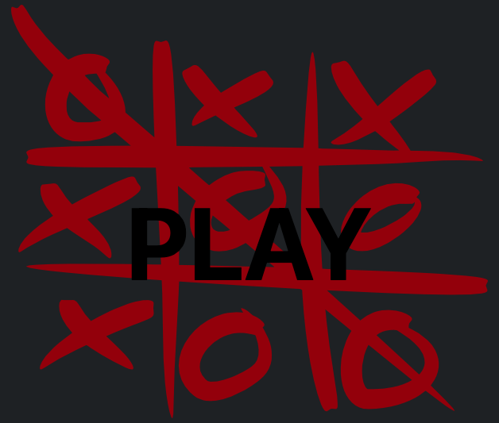

# Tic-Tac-Toe Web Game

## Table of Contents

- [Description](#description)
- [Technologies Used](#technologies-used)
- [Features](#features)
- [Database Entity-Relationship Diagram](#database-entity-relationship-diagram)
- [Screenshots](#screenshots)

## Description

A real-time Tic-Tac-Toe web game that allows players to compete and chat with each other, and track their game history and stats. Built with TypeScript using React and Express. Game state and chat messages are sent through websocket connection to enable real time communication while REST API handles authentication and user data. Frontend uses mostly bootstrap components for styles but some components like the chat box and game board are custom built.

## Technologies Used

- Frontend: TypeScript, React, Bootstrap, Axios
- Backend: TypeScript, Express
- Database: SQLite with Prisma
- Real-time: WebSockets

## Features

- Authentication & authorization using JWT and context managers
- Real-time Tic-Tac-Toe game play with chat functionality using web sockets.
- User profile page showing match statistics, recent match history, friend list, and pending friend requests.
- Friend request toasts
- Responsive design

## Database Entity-Relationship Diagram

## Authentication flow

## Screenshots

